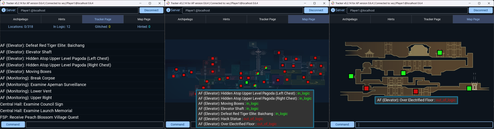

# Nine Sols MultiworldGG Randomizer

## Where is the options page?

The [player options page for this game](../player-options) contains all the options you need to configure and export a 
config file.

## What This Mod Changes

Instead of the usual intro sequence in Peach Blossom Village, the randomizer will put you immediately into the Four Seasons Pavilion, with power already on and Shuanshuan and Shennong already there. The FSP's front door will be "jammed" (i.e. the exit load zone is disabled), so you won't have immediate access to Central Hall. Instead, Teleport will be immediately unlocked, along with one other root node for you to teleport to.

Many more details can be found in the .yaml options file and the randomizer's loading screen tips. Since the loading screen tips are hard to read if you have good load times, and some first-time players may prefer to read them all now, here they are:

Randomizer Loading Screen Tips

"Press F1 to access settings for all your Nine Sols mods, including this randomizer."

"Reaching Eigong requires only Sol Seal items. There's no need to visit Tianhuo Research Institute."

"This randomizer depends on the TeleportFromAnywhere mod because an important item may end up randomly placed in a \"dead end\" you can only escape by teleporting."

"Shennong will become sick only after you acquire your first poison item."

"The randomizer's \"logic\" assumes: - Jiequan requires Charged Strike - Lady Ethereal requires Air Dash - Ji requires Tai-Chi Kick - Eigong requires Air Dash or Cloud Leap"

"There are 5 mutants who drop an item when permanently killed with Super Mutant Buster. 2 in ED (Living Area), 2 in ED (Sanctum), and 1 in TRC."

"The Peach Blossom Village rescue can be done as soon as you find the Abandoned Mines Access Token. It's no longer tied to escaping Prison and being rescued by Chiyou."

"Since talking to Ji at Daybreak Tower is a location, in this randomizer Ji becomes one of the few NPCs who can talk to you after his own death. I consider this a feature."

"All \"Limitless Realm\" segments are disabled and skipped in this randomizer."

"If Apeman Facility (Monitoring) was not your first root node, then that node will be automatically unlocked when you enter AF(M), because the upper part of AF(M) is unreachable without it."

"The large spike ball in Grotto (East) will never land in Grotto (Entry) in this randomizer, since it would block critical paths if we let it."

"This randomizer doesn't touch the items that are only reachable after the \"Point of no Return\", or after giving Shennong all poisons. You're free to replay that content or ignore it."

## Other Suggested Mods and Tools

Universal Tracker is fully supported by nine_sols.apworld, including yaml-less support, Map Pages, auto-switching between Map Pages, and glitched logic.

For now, UT is also the only supported tracker, so it's very highly recommended. See the pinned messages [in its Discord thread](https://discord.com/channels/731205301247803413/1170094879142051912) for details.

[My CutsceneSkip mod](https://thunderstore.io/c/nine-sols/p/Ixrec/CutsceneSkip/) does exactly what it sounds like.

[N00byKing's NineSolsTracker mod](https://thunderstore.io/c/nine-sols/p/N00byKing/NineSolsTracker/) may help with finding items and chests in-game.

If you're good enough at the combat to want harder-than-vanilla fights, it's worth noting that [Gogas1's BossChallengeMod](https://thunderstore.io/c/nine-sols/p/Gogas1/BossChallengeMod/) offers "random modifiers" on bosses, minibosses and regular enemies.

Players have also reported the following mods work perfectly fine with the randomizer:
- CustomSols
- HPNumbers
- PromisedEigong
- YiXPNumber

## Credits

- GameWyrm, Gregório, Hopop, Juanba, mynameis, XDrotkon and others in various Nine Sols and Archipelago-related Discord servers for feedback, discussion and encouragement
- dubi steinkek, yuki.kako, N00byKing and others from the "Nine Sols Modding" Discord server for help modding Nine Sols and for creating the other Nine Sols mods that this randomizer relies on or is often played with
- Flitter for talking me into trying out Archipelago randomizers in the first place
- All the Archipelago contributors who made that great multi-randomizer system
- Everyone at Red Candle Games who made this great game